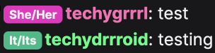
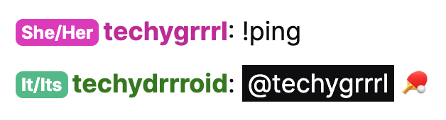
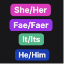

## Build instructions

See [Changes](#changes) below for changes from the original.

---

``` bash
# Install dependencies
yarn

# Build
yarn build

# Zip files
yarn zip
```

## Development instructions
``` bash
# Install dependencies
yarn

# Build and watch for file changes for development
yarn watch

# Install the extension through your browser by selecting the manifest.json file 
# or by selecting the dist folder depending on your browser
```

---

## Changes

- adds colours for easy scanning. see `./src/ts/constants/colours.ts` for details
- smaller text (80%)
- other badge tweaks: removes border, adjusts padding

Example preview in chat:




The extension uses this icon:

